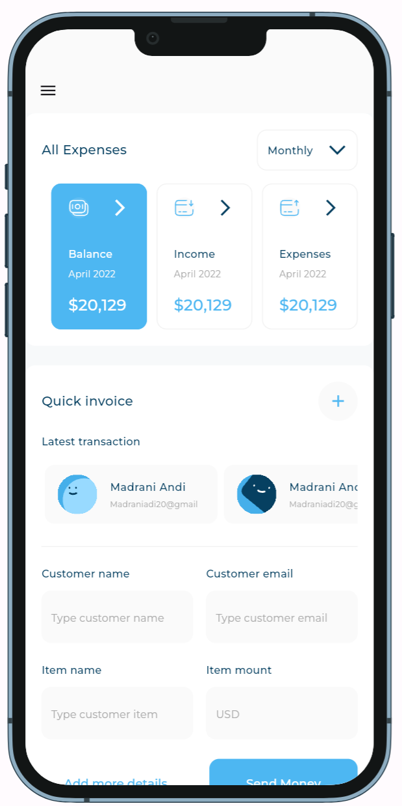
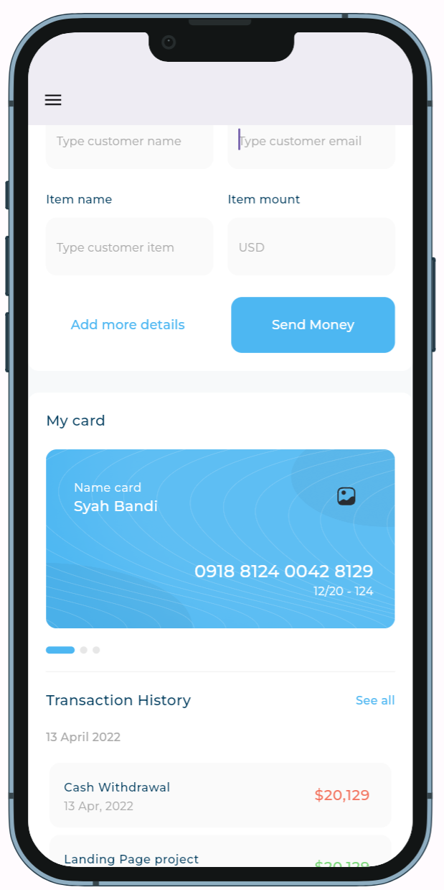
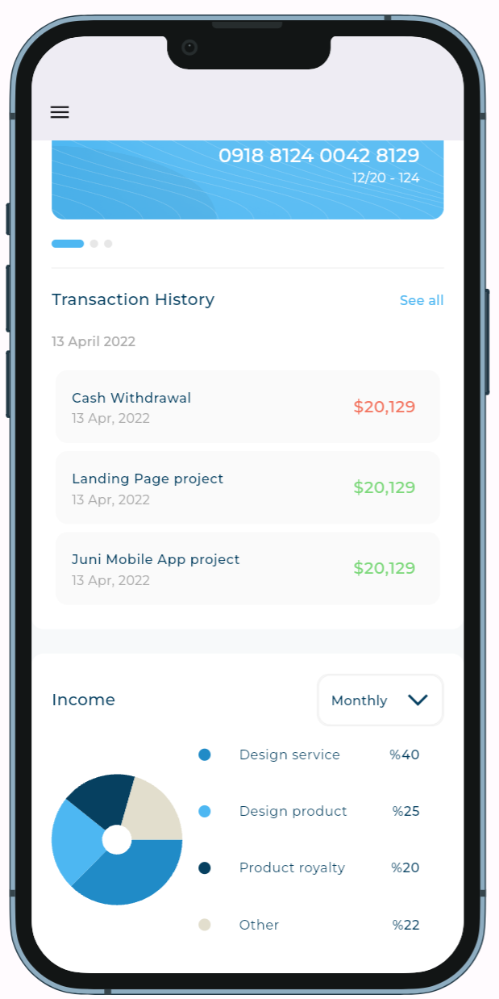
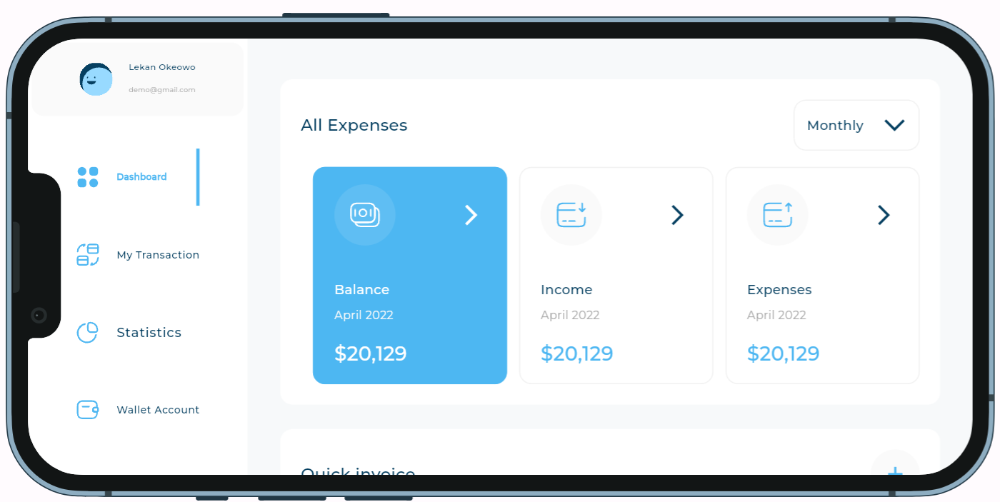
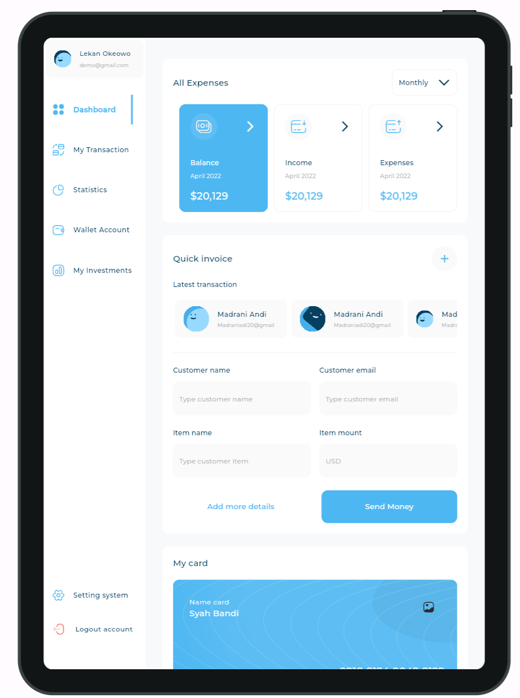
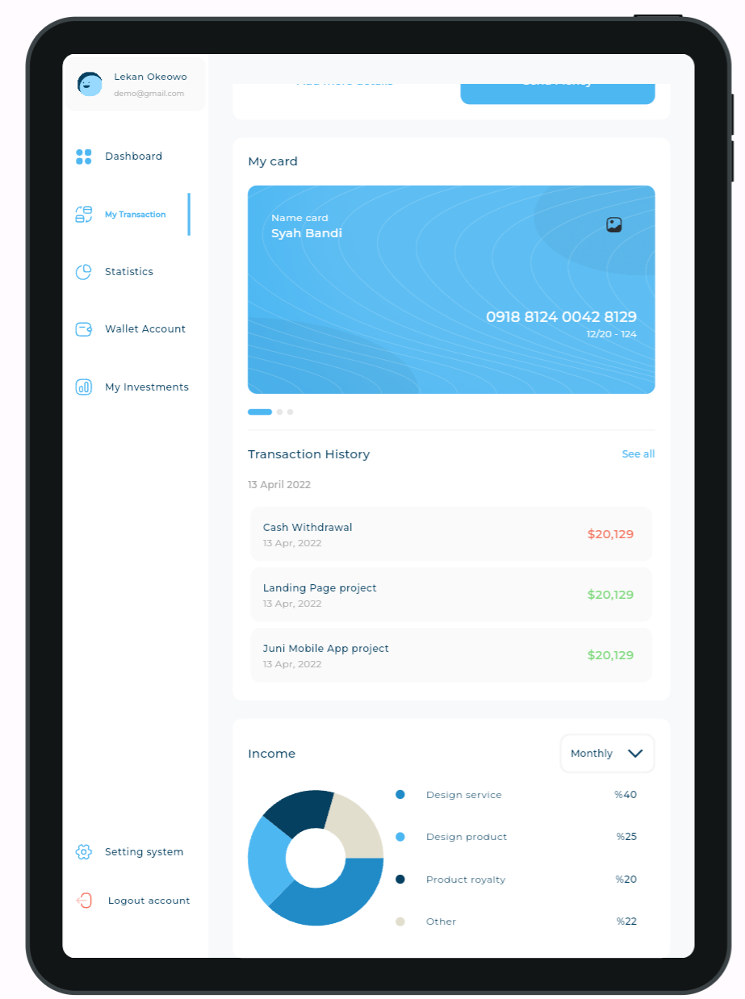
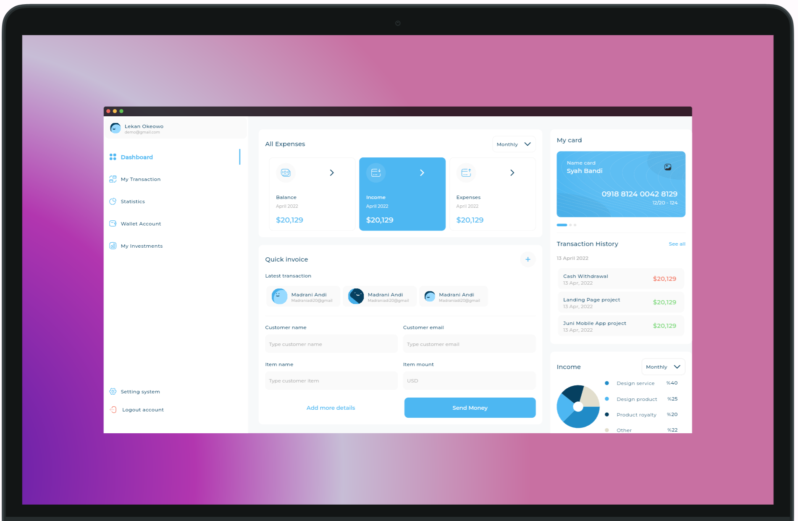
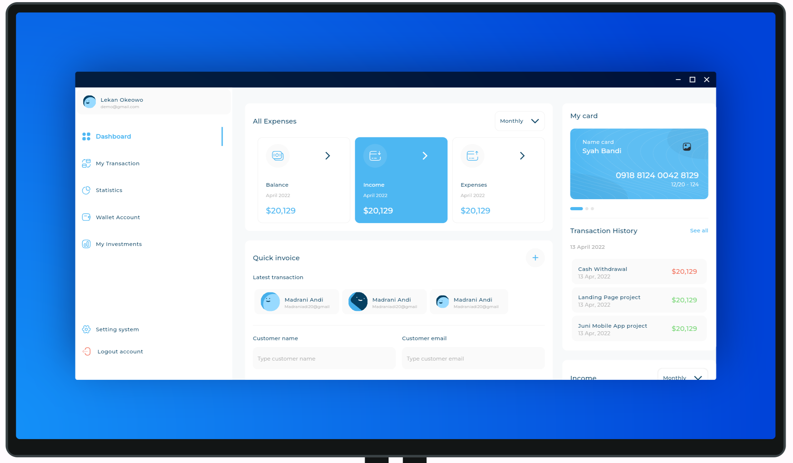

# Admin dash board (Responsive & Adaptive UI)

The main packages used in the project:

```yaml
cupertino_icons: ^1.0.2
flutter_svg: ^2.0.9
expandable_page_view: ^1.0.17
fl_chart: ^0.66.1
device_preview: ^1.1.0
```

## Screenshots:

<h3> 1- Mobile screen </h3>

<p align="center">
  
  
  
</p>

<p align="center">
  
</p>

<h3> 2- Tablet screen </h3>

<p align="center">
  
</p>

<p align="center">
  
</p>

<h3> 3- Desktop screen </h3>

<p align="center">
  
</p>

<p align="center">
  
</p>

## How to Use

**Step 1:**

Download or clone this repo by using the link below:

```
https://github.com/osamasabry9/Admin-Dashboard.git
```

**Step 2:**

Go to project root and execute the following command in console to get the required dependencies:

```
flutter pub get
```

### Folder Structure

Here is the core folder structure which flutter provides.

```
flutter-app/
|- android
|- build
|- ios
|- lib
    |- core/
    |- presentation/
    |- main
```

Here is the folder structure we have been using in this project

```
lib/core/
       |- model/
       |- utils/
       |- widgets/
presentation/
            |- views/
                |- dashboard_desktop_layout
                |- dashboard_mobile_layout
                |- dashboard_tablet_layout
                |- dashboard_view
            |- widgets/

```
